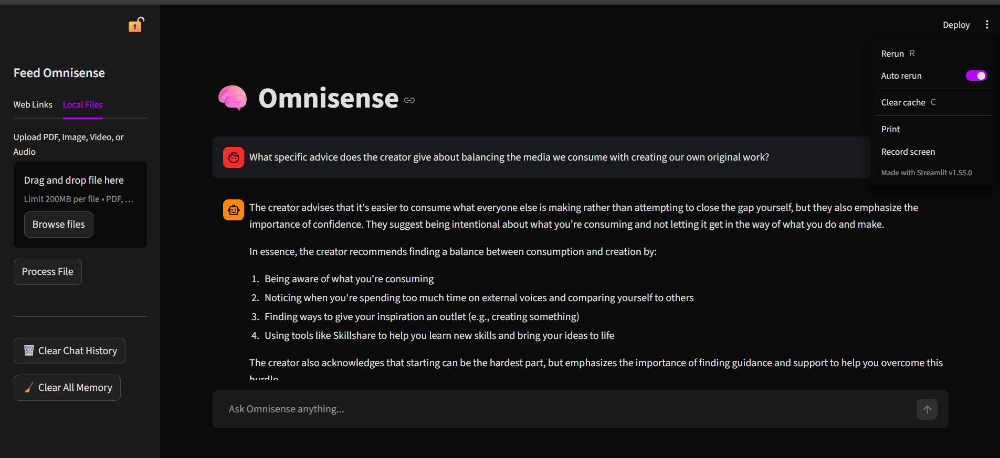

# 🧠 Omnisense: Local Multimodal RAG AI

Omnisense is a fully private, locally hosted AI assistant equipped with a **Multimodal Retrieval-Augmented Generation (RAG)** architecture. It doesn't just read text — it can **see** images and **hear** audio, storing everything in a persistent vector database to provide intelligent, context-aware answers using local LLMs.

Because everything runs locally via Docker and Ollama, **zero data ever leaves your machine.**

## ✨ Core Capabilities

* 📖 **Document Analysis** — Upload PDFs or provide webpage URLs. Omnisense parses, chunks, and memorizes documents using LangChain and PyMuPDF.
* 👁️ **Vision (OCR)** — Upload receipts, screenshots, or photos. Extracts text from images using Tesseract OCR and Pillow.
* 🎙️ **Audio Transcription** — Upload `.mp4`, `.mp3`, `.wav`, or `.m4a` files. Transcribes speech using OpenAI's Whisper model, running 100% locally.
* 🧠 **Memory Engine** — Converts all processed content into vector embeddings stored permanently in ChromaDB for instant semantic retrieval.
* 💬 **Multi-turn Chat** — Maintains conversation context across messages for natural follow-up questions.

## 🏗️ Architecture

```
┌────────────────────────────┐
│    Streamlit Frontend      │
│    (port 8501)             │
└────────────┬───────────────┘
             │ HTTP
             ▼
┌──────────────────────────────────────────────────────┐
│              FastAPI Backend (port 8000)              │
│                                                      │
│  ┌──────────────┬───────────────┬──────────────────┐ │
│  │ Documents    │ Vision (OCR)  │ Audio (Whisper)  │ │
│  │ • PyMuPDF    │ • Tesseract   │ • openai-whisper │ │
│  │ • WebLoader  │ • Pillow      │ • FFmpeg         │ │
│  │ • YT API     │               │                  │ │
│  └──────┬───────┴───────┬───────┴─────────┬────────┘ │
│         └───────────────┼─────────────────┘          │
│                         ▼                            │
│         ┌──────────────────────────┐                 │
│         │ Text Chunking (LangChain)│                 │
│         └───────────┬──────────────┘                 │
│                     ▼                                │
│         ┌──────────────────────────┐                 │
│         │ ChromaDB (Vector Store)  │                 │
│         └───────────┬──────────────┘                 │
│                     ▼                                │
│         ┌──────────────────────────┐                 │
│         │ Ollama (Llama 3.2 LLM)  │                 │
│         └──────────────────────────┘                 │
└──────────────────────────────────────────────────────┘
```

## 🛠️ Tech Stack

| Component | Technology |
|-----------|-----------|
| Frontend | Streamlit |
| Backend API | FastAPI + Uvicorn |
| LLM | Llama 3.2 (via Ollama) |
| Audio | OpenAI Whisper (small) |
| Vision | Tesseract OCR + Pillow |
| Vector DB | ChromaDB |
| Text Chunking | LangChain RecursiveCharacterTextSplitter |
| Containerization | Docker + Docker Compose |

---

## 🚀 Getting Started

### Prerequisites

1. [Docker Desktop](https://www.docker.com/products/docker-desktop/)
2. [Ollama](https://ollama.ai/)

### 1. Download the Local Model

```bash
ollama run llama3.2
```

### 2. Clone the Repository

```bash
git clone https://github.com/Yashwanth-23/Omnisense.git
cd Omnisense
```

### 3. Configure (Optional)

Copy the environment template and adjust any settings:

```bash
cp .env.example .env
```

See the [Configuration](#-configuration) section below for all available options.

### 4. Build and Launch

```bash
# Standard (CPU only)
docker compose up --build

# With NVIDIA GPU acceleration
docker compose --profile gpu up --build
```

### 5. Access the UI

Once both services are running, open your browser:

- **Chat UI**: [http://localhost:8501](http://localhost:8501)
- **API Docs**: [http://localhost:8000/docs](http://localhost:8000/docs)
- **Health Check**: [http://localhost:8000/health](http://localhost:8000/health)



---

## ⚙️ Configuration

All settings are configurable via environment variables or a `.env` file:

| Variable | Default | Description |
|----------|---------|-------------|
| `OLLAMA_BASE_URL` | `http://host.docker.internal:11434` | Ollama server address |
| `OLLAMA_MODEL` | `llama3.2` | LLM model name |
| `WHISPER_MODEL_SIZE` | `small` | Whisper model (`tiny`, `base`, `small`, `medium`, `large`) |
| `MAX_UPLOAD_SIZE_MB` | `100` | Maximum file upload size |
| `MAX_CONTEXT_CHUNKS` | `5` | Number of context chunks for RAG retrieval |
| `CHUNK_SIZE` | `1500` | Text chunk size for splitting documents |
| `CHUNK_OVERLAP` | `300` | Overlap between text chunks |
| `LLM_CONTEXT_WINDOW` | `2048` | Max tokens for LLM context |
| `LOG_LEVEL` | `INFO` | Logging level (`DEBUG`, `INFO`, `WARNING`, `ERROR`) |

## 📡 API Endpoints

| Method | Endpoint | Description |
|--------|----------|-------------|
| `GET` | `/health` | Health check + memory count |
| `POST` | `/process_video` | Ingest a YouTube video or web article |
| `POST` | `/process_file` | Upload and process PDF, image, or audio |
| `POST` | `/chat` | Ask a question against stored memories |
| `POST` | `/clear_memory` | Delete all stored memories |
| `GET` | `/docs` | Interactive API documentation (Swagger) |

---

## 🛡️ Privacy

Omnisense is designed for **absolute privacy**:

- ✅ No API keys required
- ✅ No telemetry or data collection
- ✅ Operates entirely offline (after initial model downloads)
- ✅ All files and databases remain on your local hard drive
- ✅ All AI inference runs locally via Ollama

---

## 📁 Project Structure

```
Omnisense/
├── main.py              # FastAPI backend with all ingestion + RAG endpoints
├── app.py               # Streamlit frontend interface
├── config.py            # Centralized configuration (env vars)
├── .env.example         # Environment variable template
├── Dockerfile           # Backend container (python:3.12-slim)
├── docker-compose.yml   # Multi-service orchestration (API + UI)
├── requirements.txt     # Python dependencies (pinned)
├── .streamlit/          # Streamlit theme configuration
│   └── config.toml
├── .gitignore
├── .dockerignore
└── Readme.md
```